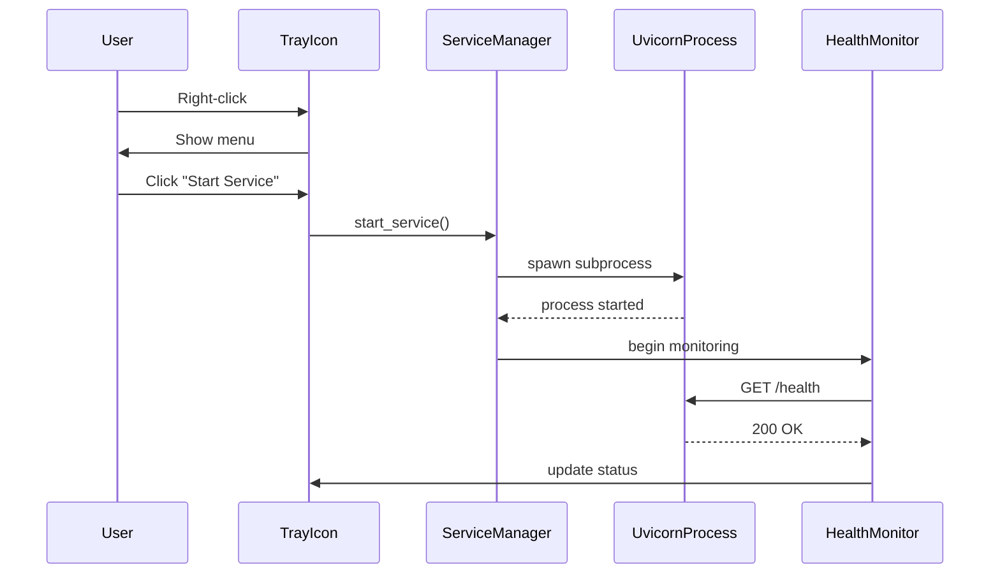

# Windows System Tray Mode

**Comprehensive guide to running Kiro Gateway as a Windows system tray application.**

---

## Table of Contents

- [Overview](#overview)
- [Quick Start](#quick-start)
- [Architecture](#architecture)
- [Configuration](#configuration)
- [Features](#features)
- [Troubleshooting](#troubleshooting)
- [Manual Testing](#manual-testing)

---

## Overview

Kiro Gateway can run in **system tray mode** on Windows, allowing it to operate as a background service without a visible console window. This mode provides a native Windows experience with a system tray icon for easy management.

### Key Benefits

- 🎯 **No Console Window** - Runs silently in the background
- 🚀 **Easy Control** - Start/stop/restart from tray menu
- 🔄 **Auto-Start** - Launch automatically with Windows
- 📊 **Health Monitoring** - Automatic service health checks
- 🔔 **Notifications** - Windows toast notifications for errors
- 📁 **Quick Access** - Open logs directly from tray menu

### Platform Support

- ✅ **Windows 10/11** - Full support
- ❌ **Linux/macOS** - Not supported (gracefully falls back to console mode)

---

## Quick Start

### Basic Usage

```bash
# Start in tray mode
python main.py --tray

# Explicitly use console mode (default)
python main.py --no-tray

# Tray mode with custom port
python main.py --tray --port 9000
```

### First Launch

1. **Start the application:**
   ```bash
   python main.py --tray
   ```

2. **Look for the tray icon:**
   - Check the Windows system tray (bottom-right corner)
   - You may need to click the "^" icon to show hidden icons

3. **Right-click the icon:**
   - Select "Start Service" to launch the gateway
   - The tooltip will show "Kiro Gateway - running" when active

4. **Enable auto-start (optional):**
   - Right-click the icon
   - Check "Start with Windows"
   - The gateway will launch automatically on next boot

---

## Architecture

### Component Overview

```
┌─────────────────────────────────────────────────────────────┐
│                     Tray Application                        │
│  ┌──────────────┐  ┌──────────────┐  ┌──────────────┐     │
│  │ TrayApp      │  │ Settings     │  │ Icon         │     │
│  │ (Main)       │  │ Manager      │  │ Manager      │     │
│  └──────┬───────┘  └──────┬───────┘  └──────┬───────┘     │
│         │                  │                  │             │
│  ┌──────▼──────────────────▼──────────────────▼───────┐   │
│  │            Service Manager                          │   │
│  │  (Subprocess lifecycle management)                  │   │
│  └──────┬──────────────────────────────────────────────┘   │
│         │                                                   │
└─────────┼───────────────────────────────────────────────────┘
          │
          ▼
┌─────────────────────────────────────────────────────────────┐
│              Gateway Service (subprocess)                   │
│  ┌──────────────────────────────────────────────────────┐  │
│  │  uvicorn + FastAPI                                    │  │
│  │  (HTTP server on localhost:8000)                      │  │
│  └──────────────────────────────────────────────────────┘  │
└─────────────────────────────────────────────────────────────┘
          │
          ▼
┌─────────────────────────────────────────────────────────────┐
│              Health Monitor (background thread)             │
│  Periodic HTTP checks to /health endpoint                   │
└─────────────────────────────────────────────────────────────┘
```

### Process Model

**Parent Process (Tray Application):**
- Runs pystray event loop in main thread
- Manages system tray icon and menu
- Spawns and monitors uvicorn subprocess
- Handles user interactions
- Performs periodic health checks

**Child Process (Gateway Service):**
- Runs uvicorn server with FastAPI application
- Operates independently of parent process
- Communicates health status via HTTP endpoint
- Receives shutdown signals from parent

### Component Interactions



---

## Configuration

### Settings File

**Location:** `%USERPROFILE%\.kiro-gateway\tray_settings.json`

**Format:**
```json
{
  "auto_start": false,
  "server_host": "0.0.0.0",
  "server_port": 8000,
  "last_state": "stopped"
}
```

**Fields:**
- `auto_start` - Enable/disable Windows startup integration
- `server_host` - Server bind address (default: 0.0.0.0)
- `server_port` - Server port (default: 8000)
- `last_state` - Last known service state (for future use)

**Notes:**
- Settings file is created automatically on first launch
- Changes are saved immediately when modified via tray menu
- Corrupted files are automatically backed up and recreated

### Windows Registry

**Auto-start is configured via Windows Registry:**

**Location:** `HKEY_CURRENT_USER\Software\Microsoft\Windows\CurrentVersion\Run`

**Entry Name:** `KiroGateway`

**Entry Value:**
```
"C:\Python310\python.exe" "C:\path\to\kiro-gateway\main.py" --tray
```

**Format:**
- Full path to Python executable
- Full path to main.py
- `--tray` flag to ensure tray mode on startup

**Notes:**
- Registry entry is created/removed via "Start with Windows" menu option
- No admin rights required (uses HKEY_CURRENT_USER)
- Entry is validated on each application start

### Log Files

**Tray Application Log:**
- **Path:** `%USERPROFILE%\.kiro-gateway\tray.log`
- **Content:** Tray application events, errors, state changes
- **Rotation:** 10 MB per file, 7 days retention
- **Format:** `YYYY-MM-DD HH:mm:ss | LEVEL | module:function:line - message`

**Gateway Service Log:**
- **Path:** `%USERPROFILE%\.kiro-gateway\service.log`
- **Content:** uvicorn/FastAPI output (stdout + stderr)
- **Rotation:** None (appended continuously)
- **Format:** Standard uvicorn log format

**Access Logs:**
- Use "Open Logs" menu item to open log directory in Windows Explorer
- Both log files are in the same directory

---

## Features

### Service State Management

**Service States:**
- `STOPPED` - Service not running
- `STARTING` - Service starting up
- `RUNNING` - Service operational
- `STOPPING` - Service shutting down
- `ERROR` - Service failed or unhealthy

**State Transitions:**
```
STOPPED → STARTING → RUNNING
RUNNING → STOPPING → STOPPED
RUNNING → ERROR (health check failed)
STARTING → ERROR (startup failed)
```

**Menu Item Behavior:**
- When `STOPPED`: Only "Start Service" is enabled
- When `RUNNING`: Only "Stop Service" and "Restart Service" are enabled
- When `STARTING` or `STOPPING`: All service controls are disabled
- When `ERROR`: "Start Service" is enabled (allows retry)

### Health Monitoring

**How It Works:**
- Health checks run every 30 seconds when service is `RUNNING`
- Checks HTTP endpoint: `http://localhost:8000/health`
- Allows up to 3 consecutive failures before reporting unhealthy
- Stops monitoring when service is not `RUNNING`

**Health Check Failures:**
- Icon changes to warning state (yellow/orange indicator)
- Service state transitions to `ERROR`
- Windows notification displayed
- Monitoring continues (allows automatic recovery)

**Recovery:**
- If health check succeeds after failure, state returns to `RUNNING`
- Icon returns to normal state
- No notification on recovery (silent)

### Windows Notifications

**Notification Types:**
- **Startup Failure** - Service failed to start (port in use, missing credentials, etc.)
- **Service Crash** - Service terminated unexpectedly
- **Authentication Failure** - Invalid or expired credentials
- **Health Check Failure** - Service became unhealthy

**Notification Features:**
- Windows toast notifications (native Windows 10/11 style)
- "View Logs" action button (opens log directory)
- Rate limiting: Maximum 1 notification per minute
- Automatic dismissal after 10 seconds

**Example Notification:**
```
Kiro Gateway - Error
Service failed to start: Port 8000 is already in use

[View Logs]
```

### Auto-Start with Windows

**How It Works:**
1. User enables "Start with Windows" in tray menu
2. Application creates registry entry in `HKEY_CURRENT_USER\...\Run`
3. On Windows startup, registry entry launches `python main.py --tray`
4. Application starts in tray mode automatically
5. Service does NOT start automatically (user must click "Start Service")

**Disabling Auto-Start:**
1. Right-click tray icon
2. Uncheck "Start with Windows"
3. Registry entry is removed

**Verification:**
- Menu item shows checkmark when enabled
- Registry entry can be viewed in Windows Registry Editor
- Test by restarting Windows

### Graceful Shutdown

**Shutdown Process:**
1. User clicks "Exit" in tray menu
2. Application sends SIGTERM to service subprocess
3. Service completes in-flight requests (up to 10 seconds)
4. If service doesn't stop, force-terminate (SIGKILL)
5. Tray icon is removed
6. Application exits

**Shutdown Events Logged:**
- Shutdown initiated (timestamp, reason)
- Graceful shutdown success/failure
- Force-kill if timeout exceeded
- Final cleanup completion

---

## Troubleshooting

### Tray Icon Not Appearing

**Symptoms:**
- Application starts but no tray icon visible
- Console window appears briefly then closes

**Solutions:**
1. Check if icon is hidden:
   - Click "^" icon in system tray to show hidden icons
   - Right-click taskbar → Taskbar settings → Select which icons appear on taskbar

2. Check tray.log for errors:
   ```bash
   notepad %USERPROFILE%\.kiro-gateway\tray.log
   ```

3. Verify Windows platform:
   - Tray mode only works on Windows
   - On Linux/macOS, use console mode

4. Check for icon file errors:
   - Icon files should be in `assets/` directory
   - If missing, application generates fallback icons

### Service Fails to Start

**Symptoms:**
- "Start Service" clicked but service remains stopped
- Error notification displayed
- Service state shows `ERROR`

**Solutions:**
1. Check service.log for details:
   ```bash
   notepad %USERPROFILE%\.kiro-gateway\service.log
   ```

2. Common errors:
   - **Port in use:** Change port in settings or stop conflicting service
   - **Missing credentials:** Verify `.env` file configuration
   - **Import errors:** Reinstall dependencies (`pip install -r requirements.txt`)

3. Try console mode for debugging:
   ```bash
   python main.py --no-tray
   ```

### Service Crashes Repeatedly

**Symptoms:**
- Service starts but stops immediately
- Repeated crash notifications
- Health checks fail

**Solutions:**
1. Check for authentication errors:
   - Verify `REFRESH_TOKEN` or `KIRO_CREDS_FILE` in `.env`
   - Check if credentials are expired
   - Try refreshing credentials

2. Check for network issues:
   - Verify internet connectivity
   - Check if VPN/proxy is required (`VPN_PROXY_URL` in `.env`)
   - Test connection to AWS endpoints

3. Review service.log for stack traces:
   ```bash
   notepad %USERPROFILE%\.kiro-gateway\service.log
   ```

### Auto-Start Not Working

**Symptoms:**
- "Start with Windows" is checked but application doesn't start on boot
- Registry entry exists but not launching

**Solutions:**
1. Verify registry entry:
   - Open Registry Editor (Win+R → `regedit`)
   - Navigate to: `HKEY_CURRENT_USER\Software\Microsoft\Windows\CurrentVersion\Run`
   - Check for `KiroGateway` entry
   - Verify paths are correct (Python executable and main.py)

2. Check for permission issues:
   - Ensure Python is in PATH
   - Try absolute paths in registry entry

3. Test manually:
   - Copy command from registry entry
   - Run in Command Prompt
   - Check for errors

### Health Checks Failing

**Symptoms:**
- Icon shows warning state
- Service state is `ERROR`
- Notification: "Health check failed"

**Solutions:**
1. Verify service is actually running:
   - Check Task Manager for `python.exe` process
   - Try accessing `http://localhost:8000/health` in browser

2. Check for port conflicts:
   - Another process may have taken the port
   - Restart service to rebind port

3. Check firewall settings:
   - Ensure localhost connections are allowed
   - Health checks use HTTP to localhost

### Settings File Corrupted

**Symptoms:**
- Application fails to start
- Error in tray.log: "Failed to load settings"

**Solutions:**
1. Application automatically backs up corrupted file:
   - Check for `tray_settings.json.bak` in `%USERPROFILE%\.kiro-gateway\`

2. Manually delete settings file:
   ```bash
   del %USERPROFILE%\.kiro-gateway\tray_settings.json
   ```
   - Application will recreate with defaults on next start

3. Manually edit settings file:
   ```bash
   notepad %USERPROFILE%\.kiro-gateway\tray_settings.json
   ```
   - Ensure valid JSON format

---

## Manual Testing

### Pre-Deployment Checklist

**Basic Functionality:**
- [ ] Tray icon appears in system tray
- [ ] Right-click menu displays correctly
- [ ] Tooltip shows "Kiro Gateway - stopped" initially
- [ ] "Start Service" launches the gateway
- [ ] Tooltip updates to "Kiro Gateway - running (http://localhost:8000)"
- [ ] Service responds to HTTP requests
- [ ] "Stop Service" stops the gateway gracefully
- [ ] "Restart Service" restarts the gateway
- [ ] "Exit" closes application completely

**Console Window:**
- [ ] Console window is hidden in tray mode
- [ ] Console window is visible in console mode (`--no-tray`)
- [ ] No console window flashing on startup

**Auto-Start:**
- [ ] "Start with Windows" creates registry entry
- [ ] Registry entry has correct paths
- [ ] Application launches on Windows startup
- [ ] "Start with Windows" checkbox reflects registry state
- [ ] Unchecking removes registry entry

**Health Monitoring:**
- [ ] Health checks run every 30 seconds when service is running
- [ ] Icon changes to warning state on health check failure
- [ ] Notification displayed on health check failure
- [ ] Service state transitions to ERROR on failure
- [ ] Health monitoring stops when service is stopped

**Notifications:**
- [ ] Startup failure notification displays
- [ ] Service crash notification displays
- [ ] Authentication failure notification displays
- [ ] Health check failure notification displays
- [ ] "View Logs" button opens log directory
- [ ] Rate limiting prevents notification spam

**Logs:**
- [ ] "Open Logs" menu item opens log directory
- [ ] tray.log contains tray application events
- [ ] service.log contains uvicorn output
- [ ] Log rotation works (10 MB limit)
- [ ] Logs are readable and formatted correctly

**Settings:**
- [ ] Settings file created on first launch
- [ ] Settings persist across restarts
- [ ] Corrupted settings file is backed up and recreated
- [ ] Settings changes save immediately

**Error Handling:**
- [ ] Port in use error displays helpful message
- [ ] Missing credentials error displays helpful message
- [ ] Service crash is detected and reported
- [ ] Graceful shutdown timeout works (10 seconds)
- [ ] Force-kill works after timeout

**Platform Detection:**
- [ ] `--tray` flag ignored on Linux/macOS
- [ ] Warning logged when `--tray` used on non-Windows
- [ ] Application starts in console mode on non-Windows

### Test Scenarios

**Scenario 1: First Launch**
1. Delete `%USERPROFILE%\.kiro-gateway\` directory
2. Run `python main.py --tray`
3. Verify tray icon appears
4. Verify settings file created with defaults
5. Start service and verify it works

**Scenario 2: Auto-Start**
1. Enable "Start with Windows"
2. Verify registry entry created
3. Restart Windows
4. Verify application launches automatically
5. Verify tray icon appears
6. Manually start service

**Scenario 3: Service Crash**
1. Start service
2. Kill uvicorn process manually (Task Manager)
3. Verify crash notification appears
4. Verify service state is ERROR
5. Restart service and verify recovery

**Scenario 4: Port Conflict**
1. Start another service on port 8000
2. Try to start Kiro Gateway
3. Verify error notification with helpful message
4. Stop conflicting service
5. Retry and verify success

**Scenario 5: Health Check Failure**
1. Start service
2. Wait for health checks to begin
3. Kill uvicorn process
4. Wait for 3 consecutive failures
5. Verify icon changes to warning state
6. Verify notification appears
7. Restart service and verify recovery

**Scenario 6: Graceful Shutdown**
1. Start service
2. Send test request (keep connection open)
3. Click "Exit" in tray menu
4. Verify service waits for request to complete
5. Verify clean shutdown within 10 seconds

**Scenario 7: Settings Corruption**
1. Start application
2. Manually corrupt settings file (invalid JSON)
3. Restart application
4. Verify backup file created
5. Verify new settings file created with defaults

---

## Advanced Topics

### Custom Icon Assets

**Icon Files:**
- `assets/tray_icon.png` - Normal state (green)
- `assets/tray_icon_warning.png` - Warning state (yellow/orange)
- `assets/tray_icon_error.png` - Error state (red)

**Requirements:**
- Format: PNG or ICO
- Dimensions: 16x16, 32x32, or 48x48 pixels
- Transparency: Supported

**Fallback:**
- If icon files are missing, application generates simple colored squares
- Warning logged in tray.log

### Subprocess Management

**Subprocess Creation:**
```python
# Windows-specific flags to hide console window
CREATE_NO_WINDOW = 0x08000000
startupinfo = subprocess.STARTUPINFO()
startupinfo.dwFlags |= subprocess.STARTF_USESHOWWINDOW
startupinfo.wShowWindow = subprocess.SW_HIDE

process = subprocess.Popen(
    cmd,
    creationflags=CREATE_NO_WINDOW,
    startupinfo=startupinfo,
    stdout=log_file,
    stderr=subprocess.STDOUT
)
```

**Graceful Shutdown:**
```python
# Send SIGTERM
process.terminate()

# Wait up to 10 seconds
try:
    process.wait(timeout=10)
except subprocess.TimeoutExpired:
    # Force kill
    process.kill()
    process.wait()
```

### Thread Safety

**Components:**
- **Main Thread:** pystray event loop (blocking)
- **Background Thread:** Health monitoring
- **Subprocess:** uvicorn server

**Thread-Safe Operations:**
- ServiceManager uses `threading.Lock` for state access
- HealthMonitor callbacks are thread-safe
- Menu updates must be called from main thread

---

## FAQ

**Q: Can I run multiple instances?**
A: No, only one instance should run at a time. Multiple instances will conflict on the same port.

**Q: Does the service start automatically with Windows?**
A: No, only the tray application starts. You must manually click "Start Service" after boot.

**Q: Can I change the port after enabling auto-start?**
A: Yes, but you must update the registry entry manually or disable/re-enable auto-start.

**Q: What happens if I close the tray application?**
A: The service stops gracefully and the application exits completely.

**Q: Can I use tray mode on Linux/macOS?**
A: No, tray mode is Windows-only. The `--tray` flag is ignored on other platforms.

**Q: How do I uninstall?**
A: Disable "Start with Windows", exit the application, and delete the project directory.

---

## Support

For issues, questions, or feature requests:
- **GitHub Issues:** https://github.com/Jwadow/kiro-gateway/issues
- **Documentation:** https://github.com/Jwadow/kiro-gateway/blob/main/README.md

---

**Last Updated:** 2025-01-XX
**Version:** 1.0.0
